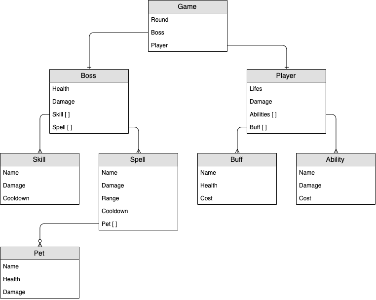
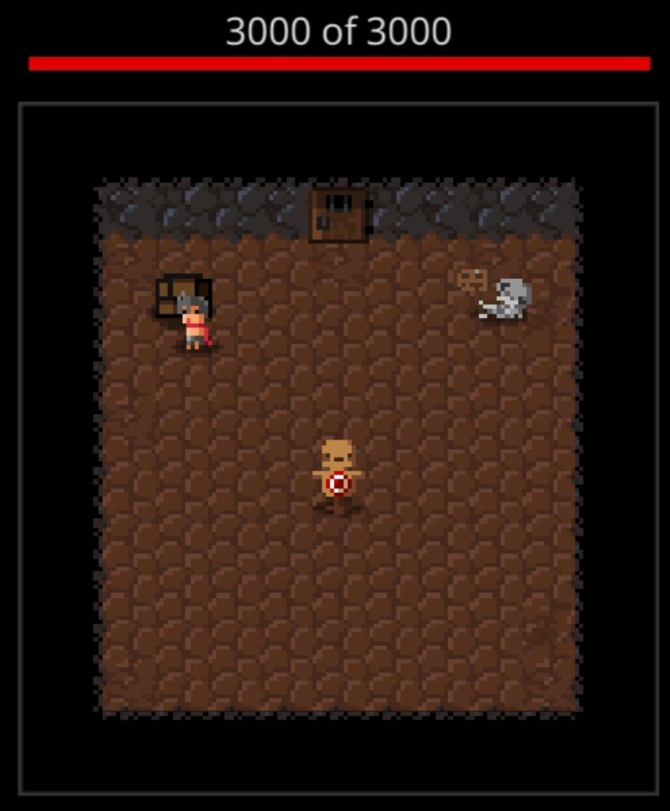
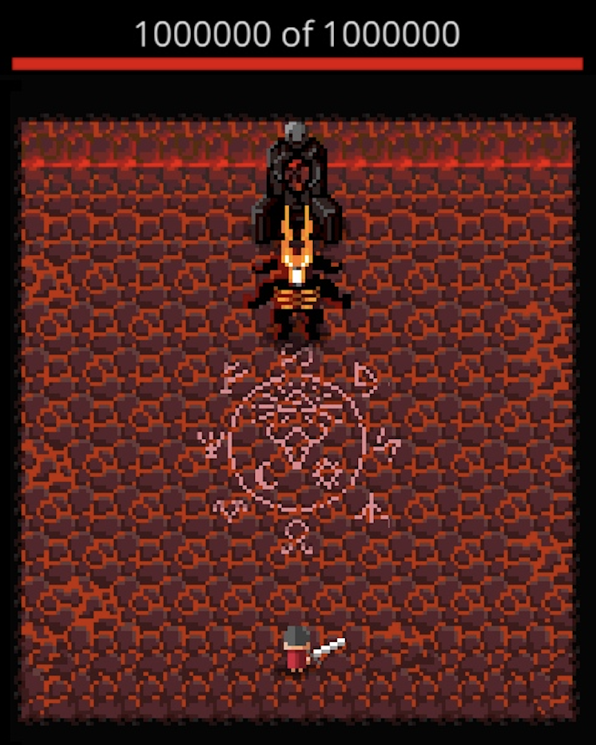
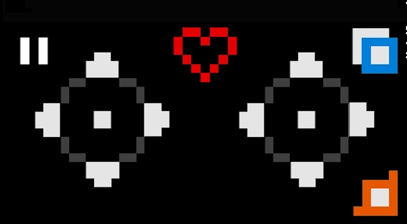
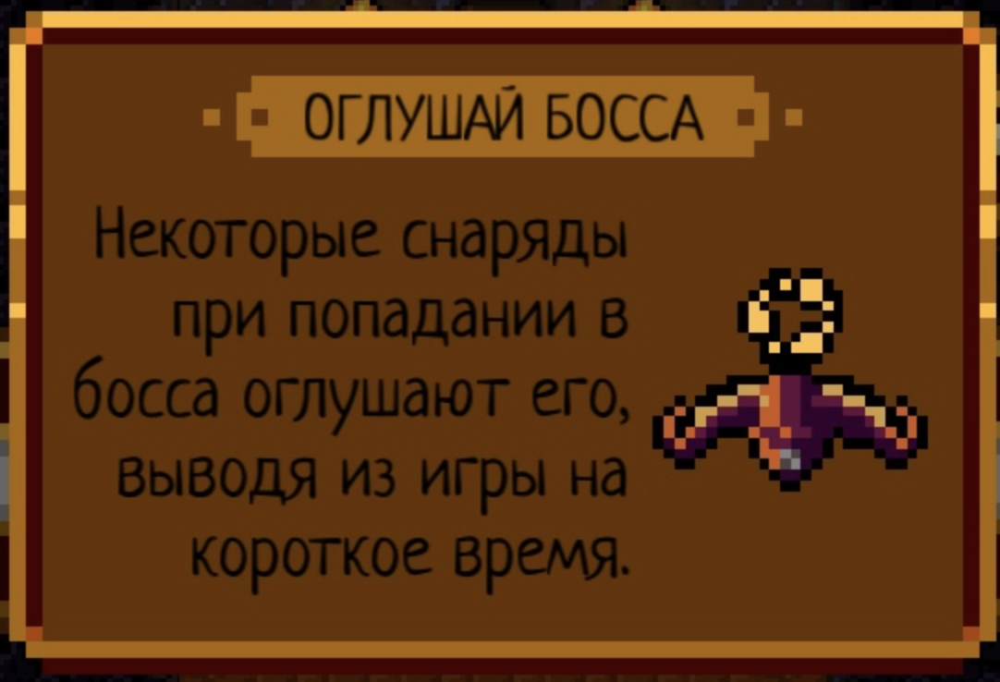
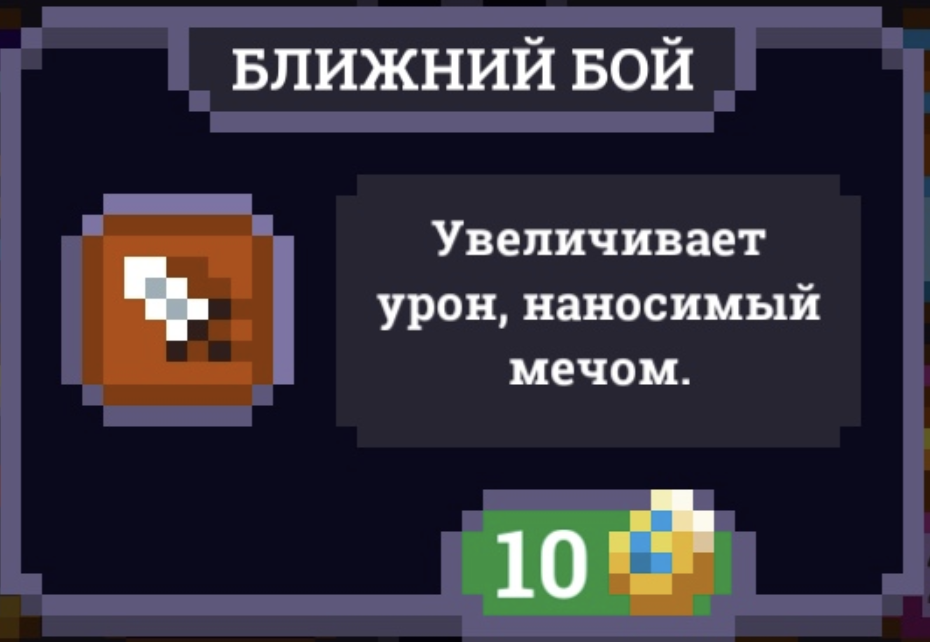
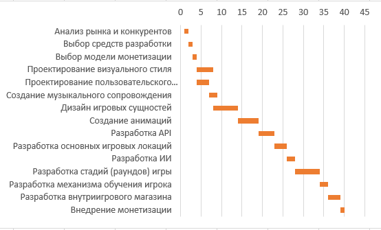

## Диаграмма сущностей

## Прототипы экранных форм

1) Главное меню

Игра начинается по нажатию в середину экрана

2) Комната подготовки

Нужна для того, чтобы взять меч и опробовать его на манекене

3) Поле с боссом

4) Управление

Левый стик отвечает за передвижение, правый - за направление атаки. Синяя кнопка менят оружие. Оранжевая кнопка нужна, чтобы сделать подкат. Сердце показывает уровень здоровья героя.

5) Конец игры

Левая кнопка позволяет воскресить героя за внутриигровую валюту. Кнопка посередине начинает игру заново. Правая кнопка означает выход из игры

6) Подсказка для игрока

7) Предмет во внутриигровом магазине

## API

1) GetGameState - получение состояния игры
    - Входные данные: нет
    - Выходные данные: текущий раунд, состояние игрока, состояние босса  
1) MovePlayer - перемещение игрока
    - Входные данные: вектор смещения от текущего положения игрока
    - Выходные данные: координаты нового положения игрока
1) AddBuffToPlayer - добавление здоровья игроку
    - Входные данные: количество здоровья для добавления, стоимость добавления в рунах
    - Выходные данные: обновленное здоровье игрока, обновленное количество рун игрока
1) AddAbilityToPlayer - добавления урона игроку
    - Входные данные: количество урона для добавления, стоимость добавления в рунах
    - Выходные данные: обновленный урон игрока, обновленное количество рун игрока
1) ShowTip - вывод подсказки для игрока
    - Входные данные: текст подсказки, изображение (опционально)
    - Выходные данные: нет (на экране появляется подсказка)
1) ChangeRunesBalance - изменение количетсва рун игрока
    - Входные данные: количество рун для начисления/списания (для начисления - положительное число, для списания - отрицательное)
    - Выходные данные - новое количество рун у игрока
1) Damage - нанесение урона игроки или боссу
    - Входная данные: цель для урона ("player", если урон наносится игроку, "boss", если урон наносится боссу), количество урона
    - Выходные данные: оставшееся количество здоровья у цели урона
1) RevivePlayer - воскрешение игрока
    - Входные данные: нет
    - Выходные данные: результат воскрешения ("true", если у игрока хватило рун для воскрешения, "false", если у игрока не хватило рун) 
1) Replay - начать игру заново
    - Входные данные: нет
    - Выходные данные: нет (обнуляется состояние игры)
1) GetVideoAd - запрос рекламного видео из рекламной сети, после которого игроку начисляются бонусные руны
    - Входные данные: нет
    - Выходные данные: видео

## Иерархическая структура работ

1) Управление
    - Анализ рынка и конкурентов
    - Выбор средств разработки
    - Выбор модели монетизации
1) Проектирование
    - Визуальный стиль игры
    - Пользовательский интерфейс
    - Музыкальное сопровождение
    - Дизайн игровых сущностей
    - Анимации
1) Разработка
    - API
    - Основные игровые локации
    - Управление игроком
    - ИИ для босса
    - Стадии (раунды) игры
    - Механизмы обучения игрока (подсказки)
    - Внутриигровой магазин
    - Внедрение монетизации

## Этапы работ

- Beta-версия
    - API
    - Полноценная первая стадия (раунд) игры
- Финальная версия
    - Все оставшиеся стадии (раунды) игры
    - Музыкальное сопровождение
    - Внутриигровой магазин
    - Монетизация

## Время выполнения по методу PERT

- Управление: 15-30 часов (наиболее вероятно 20)
- Проектирование: 30-60 часов (наиболее вероятно 45)
- Разработка: 50-80 часов (наиболее вероятно 60)

| | М | O | P | СКО | Е |
|---|---|---|---|---|---|
| Управление | 20 | 15 | 30 | 2,5 | 20,8 |
| Проектирование | 45 | 30 | 60 | 5 | 45 |
| Разработка | 60 | 50 | 80 | 5 | 61,7 |
| Итог | | | | 7,5 | 127,5 |

Суммарная трудоемкость проекта, которая не будет превышена с вероятностью 95%: E = 127,5 + 2 * 7,5 = 142,5 чел. * час

В месяц (165 чел. * час) сотрудник работает над проектом примерно 70% времени, что равно 115,5 чел. * час

Следовательно продолжительность в чел. * мес. составит 142,5 / 115,5 = 1,2 чел. * мес.

## Расписание в виде диаграммы Ганта

