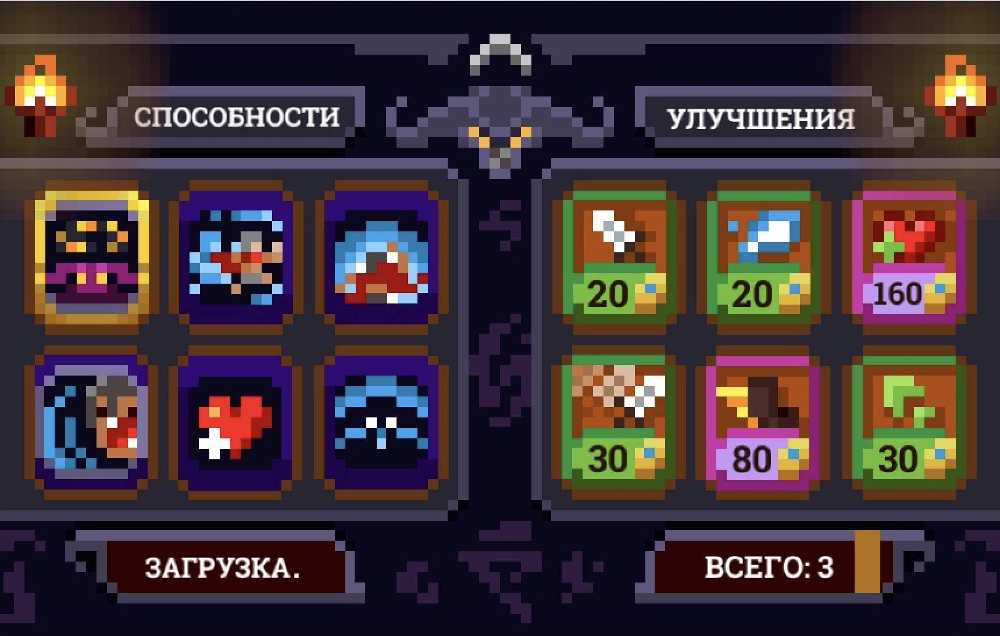
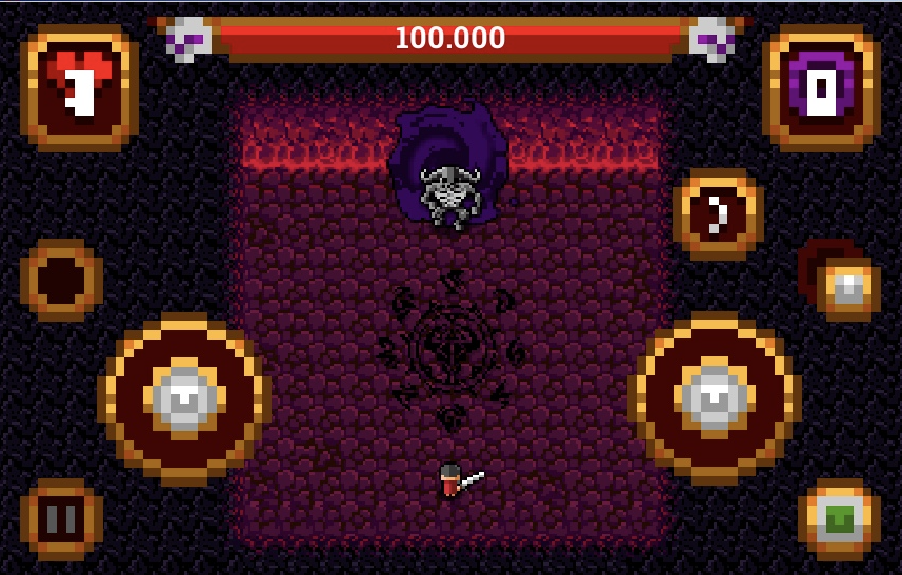
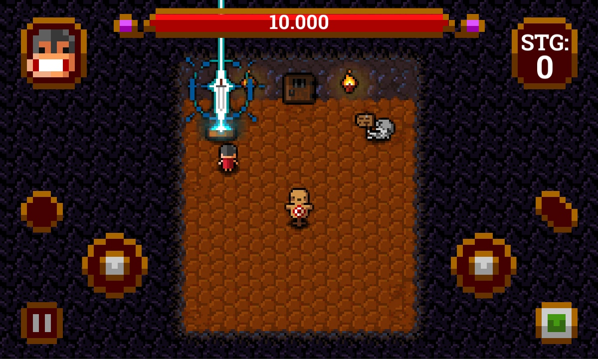
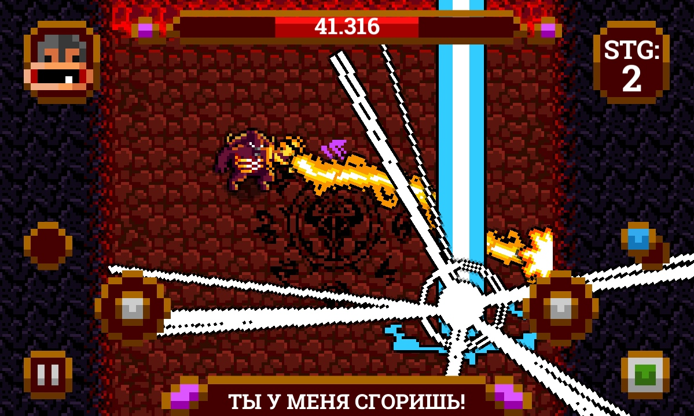

## Риски
1. Отсутствие спроса на рынке
    - Категория: Внешняя
    - Симптомы: Мало клиентов
    - Последствия: Потеря прибыли
    - Воздействие: Деньги
    - Вероятность: 3
    - Степень воздействия: 3
    - Близость: 3
    - Ранг: 6
    - Решение: Провести маркетинговое исследование
1. Отсутствие адаптивности для разных разрешений экрана
    - Категория риска: Технический
    - Симптомы: Визуальные отличия в расположении и размере - элементов интерфейса или неработоспособность элементов
    - Последствия: Неудобство или невозможность использования определенного функционала
    - Воздействие: Качество проекта
    - Вероятность: 1
    - Степень воздействия: 2
    - Близость: 1
    - Ранг: 3
    - Решение: Осуществлять тестирование игры на устройствах с различными разрешениями экрана и соотношениями сторон
1. Неудачно выбранное название
	- Категория: Управление проектом
	- Симптомы: Низкие позиции в рейтингах торговой площадки
	- Последствия: Потеря прибыли
	- Воздействия: Деньги
	- Вероятность: 2
	- Степень воздействия: 2
	- Близость: 3
	- Ранг: 5
	- Решение: Провести исследование и выбрать название, соответствующее аудитории и подходящее для SEO-оптимизации
1. Неинтересный геймплей в конечном результате
	- Категория: Управление проектом
	- Симптомы: Слабая конверсия при рекламе, отсутствие интереса аудитории к игре
	- Последствия: Маленькая аудитория
	- Воздействия: Качество проекта
	- Вероятность: 1
	- Степень воздействия: 3
	- Близость: 2
	- Ранг: 7
	- Решение: Уделить достаточно времени разработке качественного дизайн-документа
1. Опасность блокировки за нарушение правил площадки Google Play
	- Категория: Внешняя
	- Симптомы: Удаление игры с торговой площадки
	- Последствия: Потеря клиентов, трудозатраты на выявление и исправление нарушений
	- Воздействия: Время
	- Вероятность: 3
	- Степень воздействия: 3
	- Близость: 2
	- Ранг: 9
	- Решение: Подробно изучить правила и возрастные рейтинги для разных стран, и соблюдать их в ходе разработки

## Скриншоты

